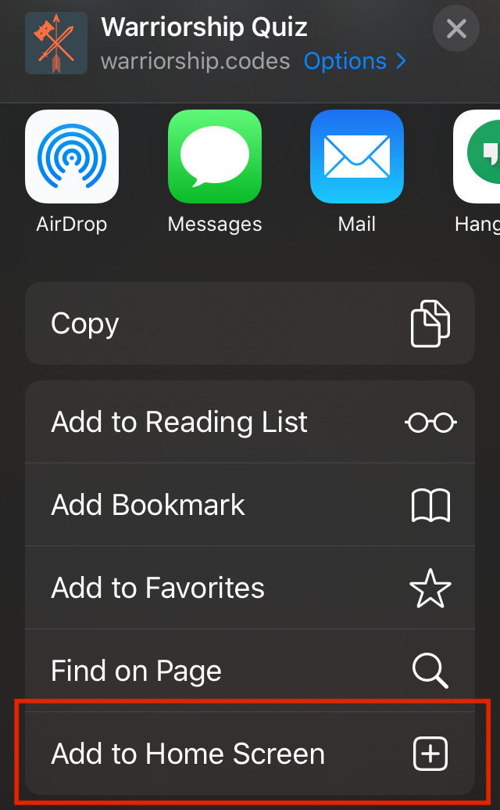
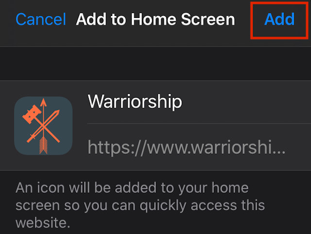
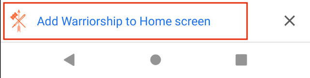
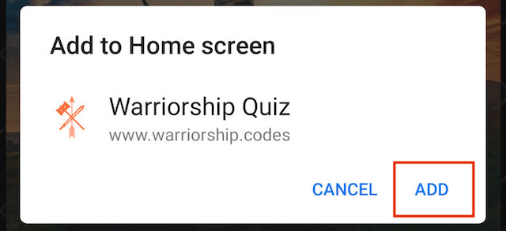
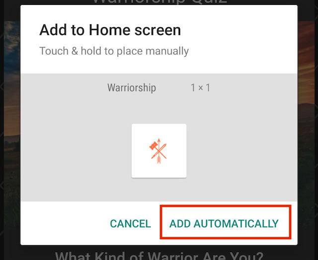
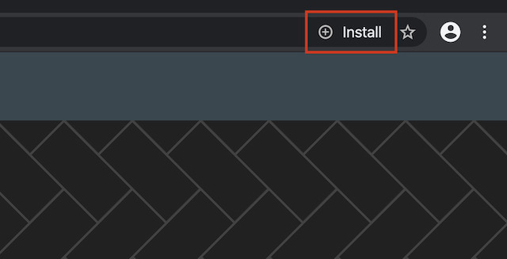
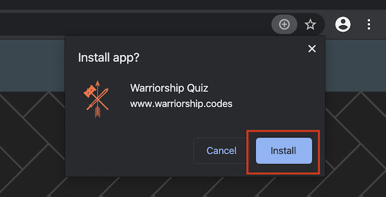

# [Warriorship Quiz](https://www.warriorship.codes/)

This informational quiz is a [PWA (Progressive Web Application)](https://web.dev/what-are-pwas/) made using Angular which can be installed on any device.

## Installation Steps

### iOS Devices

1. Tap on the share menu icon 

2. Tap on the `Add to Home Screen` button 

3. Tap on the `Add` button in the top right 

### Android Devices

1. Tap on the `Add Warriorship to Home screen` banner 

2. Tap on the `Add` button in the bottom right 

3. Tap on the `Add Automatically` button in the bottom right 

### Computers Using Chrome Browser

1. Click on the `+ Install` button in the top right 

2. Click on the `Install` button in the bottom right 

