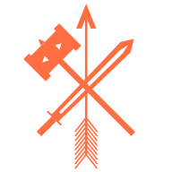

# [Warriorship Quiz](https://jdinovo.github.io/warriorship)

This informational quiz is a [PWA (Progressive Web Application)](https://web.dev/what-are-pwas/) created using [Angular](https://angular.io). It can be viewed in a web browser or installed on any device for use offline, making it exceptionally versatile and accessible to anyone. There are four warriors delineated in this warriorship quiz: Monk, Viking, Knight, or Samurai, each with their own unique cluster of attributes and preferences. The About page provides brief descriptions, including historical context for each warrior. Each time the quiz is initiated, ten questions are randomly populated from the question pool. Upon completion, the user learns what kind of warrior they may be, with the opportunity to share their results with friends via Facebook or Twitter.

## Installation Steps

### iOS Devices

1. Tap on the share menu icon 

   

2. Tap on the `Add to Home Screen` button (you may have to scroll down)
 
   

3. Tap on the `Add` button in the top right 

   

___

### Android Devices

1. Tap on the `Add Warriorship to Home screen` banner 

   

2. Tap on the `Add` button in the bottom right 

   

3. Tap on the `Add Automatically` button in the bottom right 

   

___

### Computers Using Chrome Browser

1. Click on the `+ Install` button in the top right 

   

2. Click on the `Install` button in the bottom right 

   

:copyright: 2020 James DiNovo All Rights Reserved.
